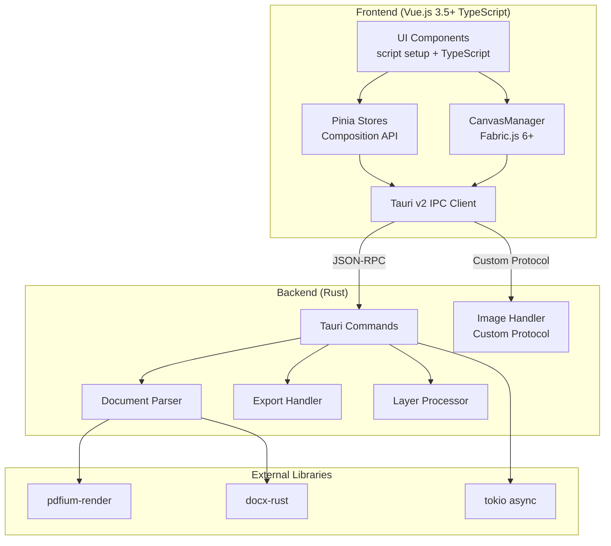
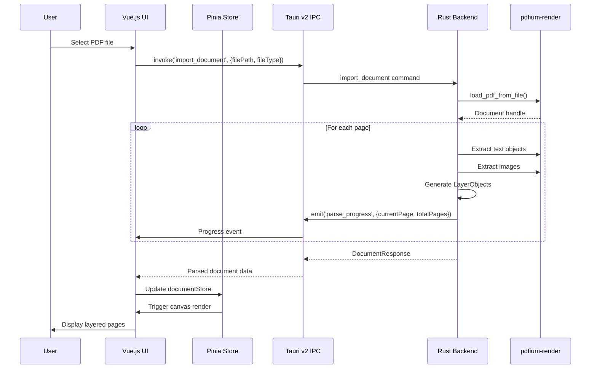

# Design Document: Book Creation Converter

## Overview

The Book Creation Converter is a cross-platform desktop application built with Vue.js 3.5+, Tailwind CSS, Tauri v2, and Rust. It transforms static PDF or DOCX documents into editable, layer-based book designs while preserving layout fidelity and image quality.

The architecture follows a clear separation between:
- **Frontend (Vue.js + Fabric.js 6+)**: UI rendering, canvas manipulation, user interactions using Composition API with `<script setup>`
- **Backend (Rust)**: Document parsing, image processing, file I/O, export generation
- **Communication (Tauri v2 IPC)**: Custom protocols for binary streaming, Channel API for progress updates, JSON-RPC for structured data

### Key Design Decisions

1. **Tauri v2 over Electron**: Smaller bundle size, native Rust performance, revamped IPC with custom protocols
2. **Fabric.js 6+ for Canvas**: Modern ES modules, improved TypeScript support, ActiveSelection for multi-select
3. **pdfium-render for PDF**: Industry-standard PDF library with accurate text/image extraction
4. **Tauri v2 Custom Protocol**: Uses `tauri::ipc::Response` for binary data, bypassing JSON serialization overhead
5. **Pinia for State Management**: Type-safe, modular stores with Composition API support
6. **Points as Coordinate System**: PDF-native units (1/72 inch) for accurate positioning

### Technology Stack (Latest Versions)

```json
{
  "frontend": {
    "vue": "^3.5.0",
    "fabric": "^6.4.0",
    "pinia": "^2.2.0",
    "typescript": "^5.6.0",
    "vite": "^6.0.0",
    "@tauri-apps/api": "^2.0.0"
  },
  "backend": {
    "tauri": "2.0",
    "pdfium-render": "0.8.37+",
    "docx-rust": "0.1+",
    "tokio": "1.0+",
    "serde": "1.0"
  },
  "testing": {
    "vitest": "^3.0.0",
    "fast-check": "^3.22.0",
    "proptest": "1.5+"
  }
}
```


## Architecture



### Data Flow




## Components and Interfaces

### Frontend Components

#### 1. CanvasManager (src/canvas/CanvasManager.ts)

Manages the Fabric.js 6+ canvas instance and layer rendering using modern ES modules.

```typescript
import { Canvas, FabricObject, ActiveSelection, FabricText, FabricImage } from 'fabric'

interface CanvasManager {
  // Initialization
  initialize(canvasElement: HTMLCanvasElement, options: CanvasOptions): void
  dispose(): void
  
  // Page rendering
  renderPage(page: PageData): void
  clearCanvas(): void
  
  // Layer operations
  addLayer(layer: LayerObject): FabricObject
  removeLayer(layerId: string): void
  updateLayer(layerId: string, updates: Partial<LayerObject>): void
  
  // Selection (Fabric.js 6+ API)
  selectLayer(layerId: string): void
  selectLayers(layerIds: string[]): ActiveSelection
  deselectAll(): void
  getSelectedLayers(): string[]
  
  // Zoom
  setZoom(level: number): void
  getZoom(): number
  zoomToFit(): void
  
  // Events (Fabric.js 6+ event system)
  onSelectionCreated(callback: (selected: FabricObject[]) => void): void
  onSelectionUpdated(callback: (selected: FabricObject[], deselected: FabricObject[]) => void): void
  onObjectModified(callback: (target: FabricObject) => void): void
  onObjectMoving(callback: (target: FabricObject) => void): void
  onObjectScaling(callback: (target: FabricObject) => void): void
}

interface CanvasOptions {
  width: number
  height: number
  backgroundColor: string
  selectionColor: string
  selectionLineWidth: number
}
```

#### 2. DocumentStore (src/stores/documentStore.ts)

Pinia store using Composition API (Setup Store syntax).

```typescript
import { ref, computed } from 'vue'
import { defineStore } from 'pinia'

export const useDocumentStore = defineStore('document', () => {
  // State
  const document = ref<BookProjectData | null>(null)
  const currentPageIndex = ref(0)
  const selectedLayerIds = ref<string[]>([])
  const undoStack = ref<HistoryEntry[]>([])
  const redoStack = ref<HistoryEntry[]>([])
  const sourceFile = ref<SourceInfo | null>(null)
  
  // Getters
  const currentPage = computed(() => 
    document.value?.document.pages[currentPageIndex.value] ?? null
  )
  const canUndo = computed(() => undoStack.value.length > 0)
  const canRedo = computed(() => redoStack.value.length > 0)
  
  // Actions
  async function importDocument(filePath: string, fileType: string): Promise<void> {
    const result = await invoke<DocumentResponse>('import_document', { filePath, fileType })
    if (result.success && result.data) {
      document.value = transformToBookProject(result.data)
    }
  }
  
  function updateLayer(pageIndex: number, layerId: string, updates: Partial<LayerObject>): void {
    // Push to undo stack before mutation
    pushHistory({ type: 'layer_update', pageIndex, layerId, previousState: getCurrentLayerState(pageIndex, layerId) })
    // Apply updates
    const page = document.value?.document.pages[pageIndex]
    const layer = page?.layers.find(l => l.id === layerId)
    if (layer) Object.assign(layer, updates)
  }
  
  function undo(): void {
    if (!canUndo.value) return
    const entry = undoStack.value.pop()!
    redoStack.value.push(entry)
    applyHistoryEntry(entry, 'undo')
  }
  
  function redo(): void {
    if (!canRedo.value) return
    const entry = redoStack.value.pop()!
    undoStack.value.push(entry)
    applyHistoryEntry(entry, 'redo')
  }
  
  return {
    document, currentPageIndex, selectedLayerIds, undoStack, redoStack, sourceFile,
    currentPage, canUndo, canRedo,
    importDocument, updateLayer, undo, redo
  }
})
```


#### 3. UIStore (src/stores/uiStore.ts)

```typescript
import { ref, computed } from 'vue'
import { defineStore } from 'pinia'

export const useUIStore = defineStore('ui', () => {
  const zoom = ref(1)
  const panelVisibility = ref({
    pages: true,
    layers: true,
    properties: true
  })
  const activeDialog = ref<'import' | 'export' | 'pageProperties' | null>(null)
  const isLoading = ref(false)
  const loadingMessage = ref('')
  const importProgress = ref<{ currentPage: number; totalPages: number; status: string } | null>(null)
  
  const zoomPercent = computed(() => Math.round(zoom.value * 100))
  
  function setZoom(level: number): void {
    zoom.value = Math.max(0.1, Math.min(3.0, level))
  }
  
  return { zoom, panelVisibility, activeDialog, isLoading, loadingMessage, importProgress, zoomPercent, setZoom }
})
```

### Backend Modules

#### 1. Document Parser (src-tauri/src/document_parser.rs)

```rust
pub trait DocumentParser {
    fn parse(&self, file_path: &str) -> Result<Vec<PageData>, ParseError>;
    fn extract_images(&self, page_index: usize) -> Result<Vec<ImageData>, ParseError>;
    fn extract_text(&self, page_index: usize) -> Result<Vec<TextData>, ParseError>;
}

pub struct PdfParser {
    pdfium: Pdfium,
}

impl PdfParser {
    pub fn new() -> Result<Self, PdfiumError>;
    pub fn parse_pdf(&self, file_path: &str) -> Result<DocumentResponse, ParseError>;
    pub fn parse_page(&self, file_path: &str, page_index: usize) -> Result<PageData, ParseError>;
}

pub struct DocxParser;

impl DocxParser {
    pub fn new() -> Self;
    pub fn parse_docx(&self, file_path: &str) -> Result<DocumentResponse, ParseError>;
}
```

#### 2. Image Handler with Tauri v2 Custom Protocol (src-tauri/src/image_handler.rs)

```rust
use tauri::ipc::Response;
use std::collections::HashMap;

pub struct ImageHandler {
    cache: HashMap<String, Vec<u8>>,
}

impl ImageHandler {
    pub fn new() -> Self {
        Self { cache: HashMap::new() }
    }
    
    // Returns binary data via Tauri v2 Response (bypasses JSON serialization)
    pub fn get_image_response(&self, image_id: &str) -> Result<Response, ImageError> {
        let data = self.cache.get(image_id)
            .ok_or(ImageError::NotFound(image_id.to_string()))?;
        Ok(Response::new(data.clone()))
    }
    
    // Stream large images via Channel API
    pub async fn stream_image(
        &self,
        image_id: &str,
        channel: tauri::ipc::Channel<&[u8]>
    ) -> Result<(), ImageError> {
        let data = self.cache.get(image_id)
            .ok_or(ImageError::NotFound(image_id.to_string()))?;
        
        for chunk in data.chunks(4096) {
            channel.send(chunk).map_err(|_| ImageError::StreamFailed)?;
        }
        Ok(())
    }
    
    pub fn cache_image(&mut self, image_id: &str, data: Vec<u8>) {
        self.cache.insert(image_id.to_string(), data);
    }
}
```


#### 3. Export Handler (src-tauri/src/export_handler.rs)

```rust
pub struct ExportOptions {
    pub format: ExportFormat,
    pub output_path: String,
    pub page_range: Option<(usize, usize)>,
    pub image_quality: u8,
    pub compress_text: bool,
    pub create_layers: bool,
    pub metadata: DocumentMetadata,
}

pub enum ExportFormat {
    Pdf,
    Docx,
    BookProj,
}

pub trait Exporter {
    fn export(&self, pages: &[PageData], options: &ExportOptions) -> Result<ExportResult, ExportError>;
}

pub struct PdfExporter;
pub struct DocxExporter;
pub struct ProjectExporter;
```

#### 4. Layer Processor (src-tauri/src/layer_processor.rs)

```rust
pub struct LayerProcessor;

impl LayerProcessor {
    pub fn new() -> Self { Self }
    
    pub fn update_layer(page: &mut PageData, layer_id: &str, updates: LayerUpdates) -> Result<LayerObject, LayerError>;
    pub fn delete_layer(page: &mut PageData, layer_id: &str) -> Result<(), LayerError>;
    pub fn add_layer(page: &mut PageData, layer: LayerObject) -> Result<String, LayerError>;
    
    // Z-index management
    pub fn reorder_layers(page: &mut PageData, layer_ids: &[String]) -> Result<(), LayerError>;
    pub fn bring_to_front(page: &mut PageData, layer_id: &str) -> Result<(), LayerError>;
    pub fn send_to_back(page: &mut PageData, layer_id: &str) -> Result<(), LayerError>;
    pub fn move_up(page: &mut PageData, layer_id: &str) -> Result<(), LayerError>;
    pub fn move_down(page: &mut PageData, layer_id: &str) -> Result<(), LayerError>;
}
```

### Tauri v2 Commands Interface

```rust
use tauri::ipc::{Response, Channel};

// Document operations
#[tauri::command]
async fn import_document(
    file_path: String,
    file_type: String,
    app_handle: tauri::AppHandle
) -> Result<DocumentResponse, String>;

#[tauri::command]
async fn export_document(
    format: String,
    pages: Vec<PageData>,
    output_path: String,
    metadata: DocumentMetadata,
    options: ExportOptions
) -> Result<ExportResult, String>;

// Layer operations
#[tauri::command]
fn update_layer(page_index: usize, layer_id: String, updates: LayerUpdates) -> Result<LayerObject, String>;

#[tauri::command]
fn delete_layer(page_index: usize, layer_id: String) -> Result<(), String>;

// Image operations - Tauri v2 binary response
#[tauri::command]
fn get_image(image_id: String) -> Response {
    let handler = IMAGE_HANDLER.lock().unwrap();
    handler.get_image_response(&image_id).unwrap_or_else(|_| Response::new(vec![]))
}

// Image streaming via Channel API
#[tauri::command]
async fn stream_image(image_id: String, channel: Channel<&[u8]>) -> Result<(), String> {
    let handler = IMAGE_HANDLER.lock().unwrap();
    handler.stream_image(&image_id, channel).await.map_err(|e| e.to_string())
}
```


## Data Models

### Core Types (TypeScript)

```typescript
interface LayerObject {
  id: string                         // Unique within page: "{type}-{pageIndex}-{seqNumber}"
  type: 'text' | 'image' | 'vector' | 'shape'
  
  // Positioning (PDF points, origin top-left)
  bounds: Bounds
  
  // Visual properties
  visible: boolean
  locked: boolean
  zIndex: number
  opacity: number                    // 0-1
  
  // Text-specific
  content?: string
  fontFamily?: string
  fontSize?: number
  fontWeight?: number
  color?: string                     // Hex color
  textAlign?: 'left' | 'center' | 'right'
  
  // Image-specific
  imageUrl?: string                  // "tauri://localhost/image/{image_id}"
  imagePath?: string
  imageData?: ImageMetadata
  
  // Shape-specific
  shapeType?: 'rectangle' | 'circle' | 'line' | 'polygon'
  strokeColor?: string
  strokeWidth?: number
  fillColor?: string
  
  // Metadata
  sourceType: 'extracted' | 'manual' | 'imported'
  role: 'background' | 'content' | 'header' | 'footer' | 'annotation'
}

interface Bounds {
  x: number      // X coordinate in points
  y: number      // Y coordinate in points
  width: number  // Width in points
  height: number // Height in points
}

interface ImageMetadata {
  width: number
  height: number
  colorSpace: 'RGB' | 'RGBA' | 'Grayscale'
  dpi: number
}

interface PageData {
  pageIndex: number
  width: number                      // Page width in points (612 for US Letter)
  height: number                     // Page height in points (792 for US Letter)
  dpi?: number
  layers: LayerObject[]
  metadata?: PageMetadata
}

interface PageMetadata {
  originalPageIndex?: number
  rotation?: 0 | 90 | 180 | 270
  mediaBox?: [number, number, number, number]
}

interface BookProjectData {
  format: 'bookproj'
  version: string
  metadata: DocumentMetadata
  document: {
    pageWidth: number
    pageHeight: number
    pages: PageData[]
  }
  settings: ProjectSettings
  history?: HistoryData
}

interface DocumentMetadata {
  title: string
  author: string
  created: string      // ISO8601
  modified: string     // ISO8601
  description?: string
}

interface ProjectSettings {
  defaultFont?: string
  defaultFontSize?: number
  exportQuality?: 'draft' | 'standard' | 'high'
}

interface HistoryEntry {
  type: 'layer_update' | 'layer_add' | 'layer_delete' | 'page_add' | 'page_delete' | 'page_reorder'
  timestamp: string
  pageIndex?: number
  layerId?: string
  previousState: unknown
  newState: unknown
}
```


### Core Types (Rust)

```rust
use serde::{Deserialize, Serialize};

#[derive(Debug, Clone, Serialize, Deserialize)]
pub struct LayerObject {
    pub id: String,
    #[serde(rename = "type")]
    pub layer_type: LayerType,
    pub bounds: Bounds,
    pub visible: bool,
    pub locked: bool,
    #[serde(rename = "zIndex")]
    pub z_index: i32,
    pub opacity: f32,
    
    // Text-specific
    pub content: Option<String>,
    #[serde(rename = "fontFamily")]
    pub font_family: Option<String>,
    #[serde(rename = "fontSize")]
    pub font_size: Option<f32>,
    #[serde(rename = "fontWeight")]
    pub font_weight: Option<u16>,
    pub color: Option<String>,
    #[serde(rename = "textAlign")]
    pub text_align: Option<TextAlign>,
    
    // Image-specific
    #[serde(rename = "imageUrl")]
    pub image_url: Option<String>,
    #[serde(rename = "imagePath")]
    pub image_path: Option<String>,
    #[serde(rename = "imageData")]
    pub image_data: Option<ImageMetadata>,
    
    // Shape-specific
    #[serde(rename = "shapeType")]
    pub shape_type: Option<ShapeType>,
    #[serde(rename = "strokeColor")]
    pub stroke_color: Option<String>,
    #[serde(rename = "strokeWidth")]
    pub stroke_width: Option<f32>,
    #[serde(rename = "fillColor")]
    pub fill_color: Option<String>,
    
    // Metadata
    #[serde(rename = "sourceType")]
    pub source_type: SourceType,
    pub role: LayerRole,
}

#[derive(Debug, Clone, Serialize, Deserialize)]
#[serde(rename_all = "lowercase")]
pub enum LayerType { Text, Image, Vector, Shape }

#[derive(Debug, Clone, Serialize, Deserialize)]
#[serde(rename_all = "lowercase")]
pub enum TextAlign { Left, Center, Right }

#[derive(Debug, Clone, Serialize, Deserialize)]
#[serde(rename_all = "lowercase")]
pub enum ShapeType { Rectangle, Circle, Line, Polygon }

#[derive(Debug, Clone, Serialize, Deserialize)]
#[serde(rename_all = "lowercase")]
pub enum SourceType { Extracted, Manual, Imported }

#[derive(Debug, Clone, Serialize, Deserialize)]
#[serde(rename_all = "lowercase")]
pub enum LayerRole { Background, Content, Header, Footer, Annotation }

#[derive(Debug, Clone, Serialize, Deserialize)]
pub struct Bounds {
    pub x: f32,
    pub y: f32,
    pub width: f32,
    pub height: f32,
}

#[derive(Debug, Clone, Serialize, Deserialize)]
pub struct PageData {
    #[serde(rename = "pageIndex")]
    pub page_index: usize,
    pub width: f32,
    pub height: f32,
    pub dpi: Option<u32>,
    pub layers: Vec<LayerObject>,
    pub metadata: Option<PageMetadata>,
}

#[derive(Debug, Clone, Serialize, Deserialize)]
pub struct DocumentResponse {
    pub success: bool,
    pub message: String,
    pub data: Option<DocumentData>,
}
```


## Correctness Properties

*A property is a characteristic or behavior that should hold true across all valid executions of a system—essentially, a formal statement about what the system should do. Properties serve as the bridge between human-readable specifications and machine-verifiable correctness guarantees.*

### Property 1: Layer ID Uniqueness and Format

*For any* imported document (PDF or DOCX), all generated layer IDs SHALL be unique across all pages AND follow the format `{type}-{pageIndex}-{seqNumber}`.

**Validates: Requirements 1.5, 2.5**

### Property 2: Layer Model Validity

*For any* LayerObject, the object SHALL contain all required base fields (id, type, bounds, visible, locked, zIndex, opacity, sourceType, role) AND type-specific fields based on layer type:
- Text layers: content, fontFamily, fontSize
- Image layers: imageUrl, imageData
- Shape layers: shapeType, strokeColor, fillColor

**Validates: Requirements 3.1, 3.2, 3.3, 3.4, 3.5, 3.6, 3.7, 3.8**

### Property 3: Layer Serialization Round-Trip

*For any* valid LayerObject, serializing to JSON then deserializing SHALL produce an object equivalent to the original (all fields match).

**Validates: Requirements 3.9, 3.10, 3.11**

### Property 4: Project Save/Load Round-Trip

*For any* valid BookProjectData, saving to .bookproj format then loading SHALL produce a document state equivalent to the original (all pages, layers, metadata, and settings match).

**Validates: Requirements 14.5, 14.6, 14.7**

### Property 5: Coordinate Transformation Formula

*For any* point coordinate in PDF points, zoom level (0.1-3.0), and DPI value, the pixel coordinate SHALL equal `pointCoordinate * (dpi / 72) * zoomLevel`.

**Validates: Requirements 4.5**

### Property 6: Zoom Range Clamping

*For any* zoom level input, the resulting zoom SHALL be clamped to the range [0.1, 3.0] (10% to 300%).

**Validates: Requirements 4.6**

### Property 7: Layer Drag Updates Coordinates

*For any* layer and any drag delta (dx, dy), after dragging the layer's bounds SHALL have x = original_x + dx and y = original_y + dy.

**Validates: Requirements 5.3**

### Property 8: Aspect Ratio Preservation on Resize

*For any* layer with aspect ratio lock enabled and any resize operation, the ratio (width/height) SHALL remain equal to the original ratio (within floating-point tolerance of 0.001).

**Validates: Requirements 5.4**

### Property 9: Z-Index Bring to Front

*For any* page with multiple layers and any selected layer, after "Bring to Front" operation, the selected layer's zIndex SHALL be greater than or equal to all other layers' zIndex values on that page.

**Validates: Requirements 6.1**

### Property 10: Z-Index Send to Back

*For any* page with multiple layers and any selected layer, after "Send to Back" operation, the selected layer's zIndex SHALL be less than or equal to all other layers' zIndex values on that page.

**Validates: Requirements 6.2**

### Property 11: Z-Index Move Up

*For any* page with multiple layers and any selected layer not at the top, after "Move Up" operation, the selected layer's position in the z-order SHALL increase by exactly 1.

**Validates: Requirements 6.3**

### Property 12: Z-Index Move Down

*For any* page with multiple layers and any selected layer not at the bottom, after "Move Down" operation, the selected layer's position in the z-order SHALL decrease by exactly 1.

**Validates: Requirements 6.4**

### Property 13: Boolean Toggle Idempotence

*For any* layer and any boolean property (visible, locked), toggling the property twice SHALL return the property to its original value.

**Validates: Requirements 7.1, 7.3**

### Property 14: Locked Layer Prevents Manipulation

*For any* layer with locked=true, all manipulation operations (move, resize, delete) SHALL be rejected or have no effect on the layer's state.

**Validates: Requirements 7.4**

### Property 15: Background Layer Locked by Default

*For any* imported document, all layers with role="background" SHALL have locked=true.

**Validates: Requirements 7.5**

### Property 16: Text Property Updates

*For any* text layer and any valid property update (fontFamily, fontSize, fontWeight, color, textAlign), the layer SHALL reflect the new property value after the update.

**Validates: Requirements 8.3**

### Property 17: Image Replacement Preserves Position

*For any* image layer and any image replacement operation, the layer's bounds.x and bounds.y SHALL remain unchanged (only imageUrl and imageData change).

**Validates: Requirements 9.5**

### Property 18: Header/Footer Role Assignment

*For any* layer marked as header or footer, the layer's role property SHALL be set to "header" or "footer" respectively.

**Validates: Requirements 10.1**

### Property 19: Header/Footer Page Range Application

*For any* header/footer layer applied to a page range [start, end], all pages in that range SHALL contain a copy of that layer.

**Validates: Requirements 10.2, 10.3**

### Property 20: Page Reorder Preserves Content

*For any* document and any page reorder operation, the total number of pages SHALL remain unchanged AND each page's layers SHALL be preserved.

**Validates: Requirements 11.3**

### Property 21: Page Duplication Preserves Layers

*For any* page duplication operation, the new page SHALL contain layers equivalent to the original page (same count, same properties).

**Validates: Requirements 11.4**

### Property 22: Page Deletion Reduces Count

*For any* document with N pages and any page deletion, the resulting document SHALL have N-1 pages.

**Validates: Requirements 11.5**

### Property 23: Page Addition Increases Count

*For any* document with N pages and any page addition at index I, the resulting document SHALL have N+1 pages AND the new page SHALL be at index I.

**Validates: Requirements 11.6**

### Property 24: Export Positional Accuracy

*For any* layer in an exported PDF, the layer's position SHALL be within ±2 points of the original position.

**Validates: Requirements 12.3**

### Property 25: Undo Restores Previous State

*For any* action that modifies document state, undoing that action SHALL restore the document to its state immediately before the action.

**Validates: Requirements 15.1**

### Property 26: Redo Restores Undone Action

*For any* undone action, redoing that action SHALL restore the document to its state immediately after the original action.

**Validates: Requirements 15.2**

### Property 27: History Maintains Minimum Entries

*For any* sequence of N actions where N >= 20, at least 20 actions SHALL be available in the undo stack.

**Validates: Requirements 15.3**

### Property 28: Image Streaming Returns Binary Data

*For any* valid image URL in format `tauri://localhost/image/{image_id}`, the image streamer SHALL return non-empty binary ArrayBuffer data.

**Validates: Requirements 18.1, 18.2, 18.3**

### Property 29: Progress Events Completeness

*For any* document import operation, progress events SHALL be emitted with currentPage, totalPages, and status fields, AND a completion event SHALL be emitted when import finishes.

**Validates: Requirements 19.1, 19.2, 19.4**


## Error Handling

### Document Import Errors

| Error Condition | Handling Strategy |
|----------------|-------------------|
| File not found | Return error with path validation message, display dialog to user |
| Corrupted PDF | Skip problematic pages, log errors, continue with valid pages |
| Corrupted DOCX | Skip problematic sections, log errors, continue with valid content |
| Encoding issues | Auto-detect encoding (UTF-8, UTF-16, Latin-1), convert to UTF-8 |
| Memory limit exceeded (>500MB) | Warn user, offer streaming mode for large documents |
| Unsupported file type | Return error with supported types list |

### Layer Operation Errors

| Error Condition | Handling Strategy |
|----------------|-------------------|
| Layer not found | Return error with layer ID, no state change |
| Invalid layer type | Return error with valid types, reject operation |
| Invalid bounds (negative dimensions) | Clamp to minimum values (1x1), log warning |
| Locked layer modification | Reject operation silently, return current state |
| Z-index out of range | Clamp to valid range [0, layer_count-1] |

### Export Errors

| Error Condition | Handling Strategy |
|----------------|-------------------|
| Output path not writable | Return error with path, prompt for new location |
| Disk space insufficient | Return error with required space, abort export |
| Invalid page range | Clamp to valid range [0, total_pages-1] |
| Image encoding failure | Use fallback format (PNG), log warning |

### Error Response Format

```typescript
interface ErrorResponse {
  success: false
  error: {
    code: string           // Machine-readable error code
    message: string        // Human-readable message
    details?: unknown      // Additional context
    recoverable: boolean   // Can operation be retried?
  }
}
```

## Testing Strategy

### Dual Testing Approach

This project uses both unit tests and property-based tests for comprehensive coverage:

- **Unit tests**: Verify specific examples, edge cases, and error conditions
- **Property tests**: Verify universal properties across all valid inputs using randomized testing

### Testing Framework

- **Frontend (TypeScript)**: Vitest 3.0+ with fast-check 3.22+ for property-based testing
- **Backend (Rust)**: Built-in test framework with proptest 1.5+ for property-based testing

### Property-Based Testing Configuration

- Minimum 100 iterations per property test
- Each property test references its design document property
- Tag format: **Feature: book-creation-converter, Property {number}: {property_text}**

### Test Categories

#### Unit Tests (Specific Examples)

1. **Document Import**
   - Import sample PDF with known structure
   - Import sample DOCX with embedded images
   - Import empty document
   - Import single-page document

2. **Layer Operations**
   - Create layer with all required fields
   - Update specific layer properties
   - Delete layer by ID
   - Reorder layers in specific sequence

3. **Page Operations**
   - Add page at beginning, middle, end
   - Delete first, middle, last page
   - Duplicate page with complex layers

4. **Export**
   - Export to PDF with default options
   - Export to DOCX with metadata
   - Save and load project file

#### Property-Based Tests (Universal Properties)

Each correctness property (1-29) will have a corresponding property-based test that:
1. Generates random valid inputs using fast-check/proptest arbitraries
2. Executes the operation
3. Verifies the property holds

#### Edge Case Tests

1. **Empty inputs**: Empty document, empty page, empty layer list
2. **Boundary values**: Maximum page count, maximum layer count, extreme coordinates
3. **Encoding**: UTF-8, UTF-16, Latin-1 text content
4. **Large files**: Documents approaching memory limits

### Test File Structure

```
src/
├── canvas/
│   ├── CanvasManager.ts
│   └── CanvasManager.test.ts
├── stores/
│   ├── documentStore.ts
│   └── documentStore.test.ts
├── models/
│   ├── layer.ts
│   └── layer.test.ts
└── utils/
    ├── serialization.ts
    └── serialization.test.ts

src-tauri/src/
├── document_parser.rs
├── document_parser_test.rs
├── layer_processor.rs
├── layer_processor_test.rs
├── export_handler.rs
└── export_handler_test.rs
```

### Vitest Configuration Example

```typescript
// vitest.config.ts
import { defineConfig } from 'vitest/config'
import vue from '@vitejs/plugin-vue'

export default defineConfig({
  plugins: [vue()],
  test: {
    projects: [
      {
        test: {
          name: 'unit',
          environment: 'jsdom',
          include: ['src/**/*.test.ts'],
          exclude: ['src/**/*.property.test.ts']
        }
      },
      {
        test: {
          name: 'property',
          environment: 'jsdom',
          include: ['src/**/*.property.test.ts'],
          testTimeout: 30000 // Property tests may take longer
        }
      }
    ]
  }
})
```
